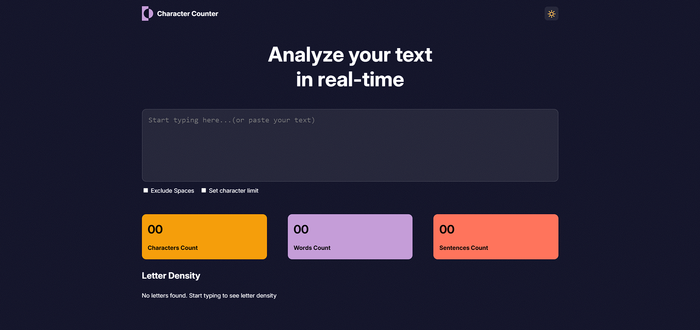
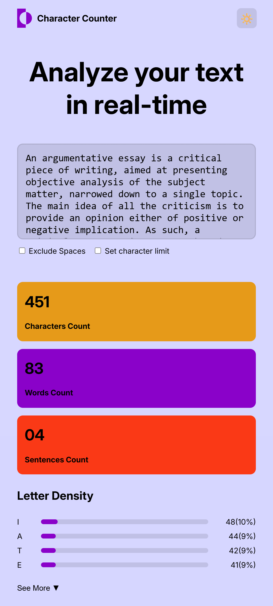

# Character Counter

A simple real-time web application that analyzes your text and provides live statistics.

## Features

- Count characters, words, and sentences.
- Letter density visualization with bars and percentages.
- Dark/Light theme toggle.
- Option to exclude spaces from counts.
- Option to set a maximum character limit.
- "See More / See Less" button for letter density.

## How to Use

1. Open `index.html` in your browser.
2. Start typing or paste your text in the textarea.
3. The counters and letter density will update in real-time.

## Screenshots

  

## Technologies Used

- HTML
- CSS (with CSS variables for themes)
- JavaScript (DOM manipulation, event listeners, regex)

## Notes

- The app is fully client-side; no backend required.
- Works on desktop and mobile devices (responsive layout).
